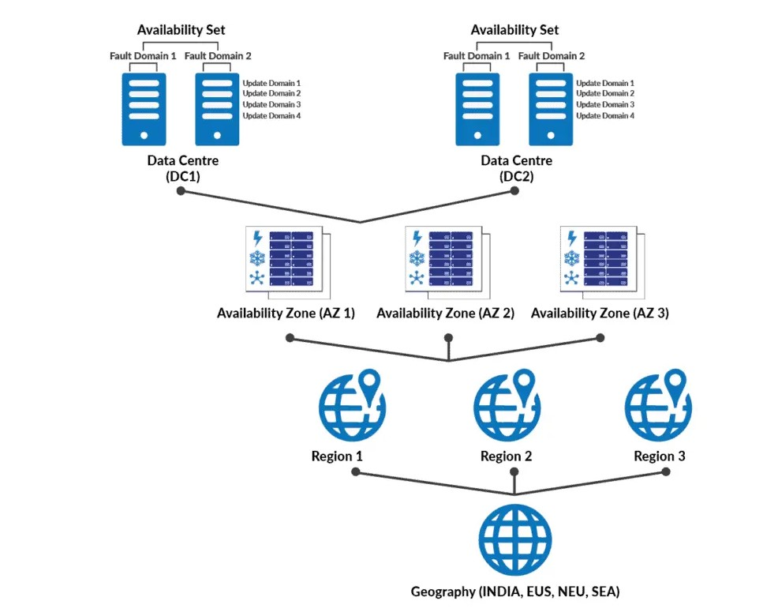

# Microsoft Azure Overview

Azure is a cloud computing service created by Microsoft for building, testing, deploying, and managing applications and services through Microsoft-managed data centers.

- **Service Types**:
  - **Infrastructure as a Service (IaaS)**: Provides virtual machines, storage, networks, etc.
  - **Platform as a Service (PaaS)**: Offers runtime environments for application development, deployment, and management without dealing with the underlying infrastructure.
  - **Software as a Service (SaaS)**: Delivers software applications over the internet on a subscription basis.

- **Key Features**:
  - **Scalability**: Resources can be scaled up or down based on demand.
  - **Flexibility**: Offers a wide range of services that can cater to various needs, such as AI, machine learning, IoT, and more.
  - **Security**: Provides robust security features to protect data and applications.
  - **Global Reach**: Azure operates in multiple data centers around the world, ensuring high availability and redundancy.

## Regions & Availability Zones

A **region** is a set of data centers, deployed within a latency-defined perimeter and connected through a dedicated regional low-latency network. **Regions** provide customers the flexibility to deploy applications and data workloads in specific geographic locations to meet legal, compliance, or tax requirements and to ensure data residency.

**Availability Zones** are physically separate locations within an Azure region. Each zone is made up of one or more datacenters equipped with independent power, cooling, and networking. By architecting your solutions to use replicated resources across zones, you can achieve higher availability and fault tolerance.

### Key Points
- **Region Pairs**: Azure regions are paired with another region within the same geography (such as the US, Europe, or Asia) to provide redundancy in case of an entire region failure.
- **Geo-Redundancy**: Services like Azure Storage and SQL Database offer geo-redundant storage, automatically replicating data to a secondary region within the same geography.

## Organization of Azure Resources

- **Resource**: A manageable item available through Azure, like virtual machines, databases, or storage accounts.

- **Resource Group**:
  - A container holding related resources for an Azure solution.
  - Facilitates managing and organizing resources by lifecycle, application, or environment.

- **Subscription**:
  - A logical container used to bill for the resources created.
  - Can contain multiple resource groups.
  - Offers isolation: Different projects or environments (like production, development, and testing) can be organized into separate subscriptions.

- **Management Groups**:
  - Can organize subscriptions into containers called "management groups" and manage access, policy, and compliance  conditions.

- **Tags**:
  - Key-value pairs assigned to resources and resource groups.

## Azure Service Categories

- **Compute**:
  - Services: Virtual Machines, Azure Kubernetes Service (AKS), Azure Functions, App Services
  - Use: Hosting applications, containers, serverless computing

- **Networking**:
  - Services: Virtual Network, Load Balancer, VPN Gateway, Azure DNS
  - Use: Setting up networks, connecting Azure resources, ensuring availability

- **Storage**:
  - Services: Blob Storage, Disk Storage, File Storage, Queue Storage
  - Use: Storing data, backups, and disaster recovery

- **Database**:
  - Services: Azure SQL Database, Cosmos DB, Azure Database for MySQL, Azure Database for PostgreSQL
  - Use: Database management, storage, and operations

- **AI and Machine Learning**:
  - Services: Azure Machine Learning, Azure Cognitive Services
  - Use: Building and deploying AI models, integrating AI into applications

- **Internet of Things (IoT)**:
  - Services: IoT Hub, Azure Sphere, IoT Central
  - Use: Connecting and managing IoT devices, data analysis

- **DevOps**:
  - Services: Azure DevOps, GitHub Actions for Azure
  - Use: Project and collaboration tools, CI/CD, automation

- **Security**:
  - Services: Azure Active Directory, Azure Sentinel, Azure Key Vault
  - Use: Identity and access management, threat protection, encryption

- **Identity**:
  - Services: Azure Active Directory, Azure Active Directory B2C
  - Use: Identity services, secure access for applications

- **Integration**:
  - Services: Logic Apps, Event Grid, Service Bus
  - Use: Connecting apps, data, and services, building integrations

- **Analytics**:
  - Services: Azure Synapse Analytics, HDInsight, Azure Databricks
  - Use: Big data analytics, data warehousing, and ETL processes

This categorization helps you to navigate and choose the right services for your specific needs.

## Using the Azure Pricing Calculator

- **Budget Planning**:
  - Estimate the costs of your Azure services before deployment.
  - Helps in financial planning and avoiding unexpected expenses.

- **Cost Optimization**:
  - Compare the costs of different Azure resource configurations and services to find the most cost-effective solution for your needs.
  - Identify potential savings by adjusting resources, such as scaling down underutilized services.

- **Scenario Analysis**:
  - Evaluate the financial impact of different deployment scenarios, such as different regions, service tiers, or architectures.
  - Useful for decision-making in project planning phases.

- **Quoting**:
  - Generate cost estimates for proposals or internal budget approvals.
  - Provides a detailed breakdown of expected costs for transparency with stakeholders.

- **Understanding Pricing Models**:
  - Learn about Azure's pricing models, including pay-as-you-go, reserved instances, and spot pricing.
  - Helps in selecting the best pricing model based on your usage patterns and commitment level.

- **Exploring Azure Offers**:
  - Review and include applicable Azure offers, such as Azure Hybrid Benefit or free services, in your cost calculations.
  - Maximizes the value of your existing investments and available Azure promotions.

**When to Use**:
- **Before launching a new project**: To get an estimate of the costs involved.
- **During the design phase**: To optimize architecture for cost.
- **For ongoing projects**: To explore cost-saving opportunities by simulating changes to your current setup.

In essence, the Azure Pricing Calculator is a proactive tool for managing and optimizing your Azure expenditures, ensuring that you make informed decisions regarding your cloud investments.

### VM
Region
VPN
Resource group
Subnet
