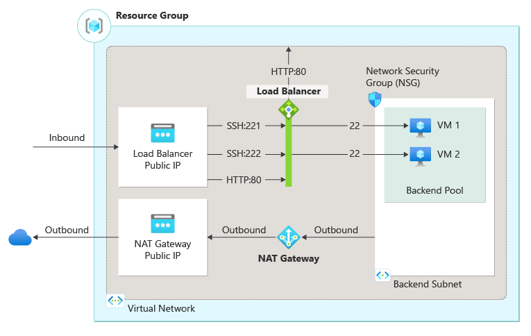
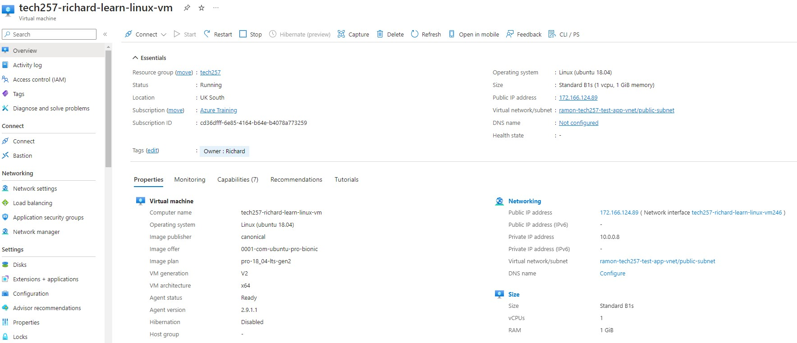
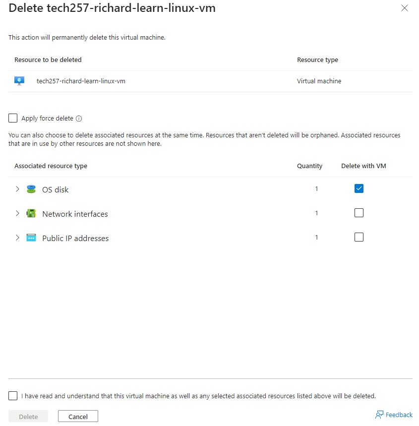

## Virtual Machines

## How Virtual Machines Work:

A Virtual Machine (VM) is a software emulation of a physical computer that runs an operating system. A **hypervisor** manages VMs by allocating physical resources (like CPU, memory, and storage) to each VM.

**Components**:
  - **Virtual CPU (vCPU)**: Simulated CPU that performs computation tasks for the VM.
  - **Virtual Memory**: Allocation of physical memory from the host to the VM.
  - **Virtual Disk**: A file or set of files that appear as a physical disk drive to the VM.
  - **Virtual Network Interface**: Enables the VM to connect to a network as if it were a physical computer.

- **Isolation**: Each VM operates in an isolated environment, unaware of other VMs on the same host, ensuring security and stability.

## Logging into Azure

- **Option 1**: Navigate and log into the Azure Portal: [https://portal.azure.com](https://portal.azure.com)

- **Option 2**: For command-line enthusiasts, Azure also offers the Azure Command-Line Interface (CLI) or Azure PowerShell module, which allows you to log in and manage Azure resources from a terminal or command prompt.
  - **Azure CLI**: Use the command `az login`, and a browser window will open for you to complete the authentication.
  - **Azure PowerShell**: Use the command `Connect-AzAccount`, and follow the prompts for authentication.

## Setting Up an SSH Key for Azure Access

**Step 1**: Generate SSH Key Pair

Open a terminal and use the command:

`ssh-keygen -t rsa -b 2048 -C "youremail@example.com"`

When prompted, enter a name for the key pair, then press Enter.

**Step 2**: Save Public and Private Keys

Save the keys in your local machine's `.ssh` directory.

**Step 3**: Add SSH Public Key to Azure
  - On the Azure Portal, select **SSH public key**.
  - Paste your public key into the **SSH public key** field.

## Creating a VM on Azure

- **Step 1: Create a New Virtual Machine**
  - On the Azure dashboard, select "Virtual machines".
  - Alternatively, you can search for "Virtual machines" in the search bar.
  - On the "Virtual machines" page, click _Create > Azure virtual machine_. You will be taken through to options to configure the VM.

- **Step 2: Configure Settings**
  - **Subscription**: Choose the _Azure Training_ subscription.
  - **Resource Group**: Choose _tech257_ as the resource group.
  - **Virtual Machine Name**: Enter a name for your VM.
  - **Region**: Select _UK South_ for the Azure region to deploy the VM.
  - **Availability Options**: At this stage, _No infrastructure redundancy required_.
  - **Security**: _Standard_
  - **Image**: Choose the OS image: _Ubuntu Pro 18.04 LTS - Gen2_.
  - **Size**: Choose the VM size based on your performance and cost requirements. In this case _Standard_B1s - 1 vcpu, 1GiB_.

- **Step 3: Administrator Account**
  - Set user name to _adminuser_.
  - We'll use an SSH public key for authentication: an existing public key has already been added to the account.

- **Step 4: Inbound Port Rules**
  - We'll allow port 22 for SSH connections and port 80 for those over HTTP.

- **Step 5: Disks**
  - We'll use the _Standard SSD_ for the OS disk.
  - Check _Delete with VM_.

- **Step 6: Network Settings**
  - Select a Virtual Network. In this case: _ramon-tech257-test-app-vnet_
  - Subnet: _public_.

- **Step 7: Tags**
  - Define the key-value pair for the resource: _Owner: Richard_.

- **Step 8: Review and Create**
  - Review all settings, and then click "Create" to deploy your VM.

Deployment may take a few minutes. Once complete, you can view the VM on the Azure portal, as below:

## Connect to VM Using SSH

In the terminal, use the command:

`ssh -i ~/.ssh/<your-private-key> adminuser@VM_IP_address`

## Deleting a VM on Azure

  - On the "Virtual machines" page from the Azure portal dashboard, find and select the VM you wish to delete.
  - On the VM's overview page, click on the "Delete" button.
  - You may be asked to confirm the deletion. Confirm by typing the name of the VM or following the prompt instructions.

**Delete Associated Resources (Optional)**

When deleting a VM, consider if you also want to delete associated resources like disk storage, network interfaces, or public IP addresses. These resources are billed separately and won't be automatically deleted with the VM.

**Verify Deletion**

After deletion, ensure that the VM and any selected associated resources no longer appear in their respective sections within the Azure portal.

**Important Notes**:
- Deleting a VM is irreversible. Ensure you have backed up any necessary data before proceeding.
- Remember that deleting the VM does not automatically delete associated resources like disks or network interfaces, which might incur charges if left undeleted.

<!-- 
## Azure Virtual Network Basics

- **Definition**: An Azure Virtual Network (VNet) is a logically isolated network on the Azure cloud that enables Azure resources, like virtual machines (VMs), to securely communicate with each other, the internet, and on-premises networks.

- **Components**:
  - **Subnets**: Segments within a VNet that allow you to organize and secure resources into logical groups.
  - **IP Addresses**: Assignable to resources within a VNet, including both static and dynamic options.
  - **Route Tables**: Define how network traffic is routed within and outside of a VNet.
  - **Network Security Groups (NSGs)**: Used to allow or deny network traffic to subnets or network interfaces (NIC) in a VNet.

- **Connectivity Options**:
  - **VNet Peering**: Connects two VNets in the same or different Azure regions, allowing resources to communicate as if they were in the same network.
  - **VPN Gateway**: Connects an Azure Virtual Network to an on-premises network over the internet using a secure tunnel.
  - **ExpressRoute**: Connects your on-premises networks to Azure through a private connection facilitated by a connectivity provider.

- **Benefits**:
  - **Isolation and Segmentation**: VNets provide isolation from other VNets, allowing for secure deployments within Azure.
  - **Internet Connectivity**: Resources within a VNet can have outbound internet connectivity by default, and inbound connectivity can be configured.
  - **Filtering and Routing**: NSGs and route tables provide filtering and routing to manage network traffic flow.

- **Use Cases**:
  - Hosting a network of interconnected virtual machines or applications.
  - Securely integrating cloud-based applications with on-premises data centers.
  - Creating isolated environments for testing and development.

Azure Virtual Networks provide the foundational building blocks for networking in the Azure cloud, offering flexibility, security, and scalability for managing cloud-based networked applications. -->