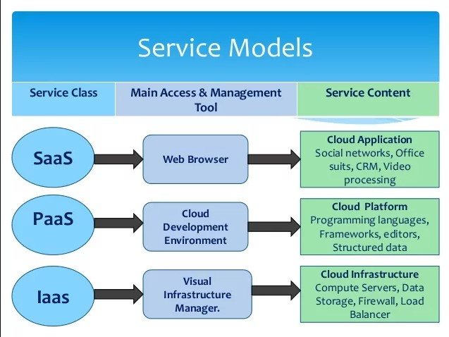
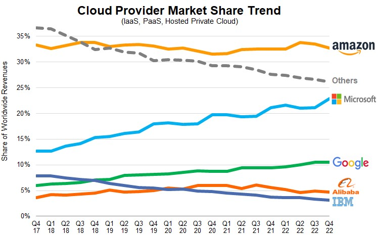

# What is Cloud Computing?

Cloud Computing is the delivery of computing services over the Internet ("the cloud"), e.g:
- servers
- storage
- databases
- networking
- software
- analytics
- and more

### The history of Cloud Computing

- **1960s**: Conceptual foundations by J.C.R. Licklider with his idea of an "Intergalactic Computer Network".
- **1999**: Salesforce became one of the first to deliver enterprise applications via a website.
- **2002**: AWS launched.
- **2006**: Amazon launched Elastic Compute Cloud (EC2), allowing users to rent virtual computers.
- **2008**: Google launched Google App Engine, a platform for developing and hosting web applications.
- **2010**: Microsoft launched Azure, offering a wide range of cloud services.
- **2012**: Google Cloud Platform was announced, providing a suite of cloud computing services.

### With Cloud Computing, you can:

1. **Host Websites and Web Applications**
2. **Store, Back Up, and Recover Data**
3. **Stream Audio and Video**
4. **Deliver Software on Demand**
5. **Analyze Data**
6. **Embed Intelligence**
7. **Integrate and Connect**
8. 

### What are the 4 MODELS of Cloud?

1. **Public Cloud**
2. **Private Cloud**
3. **Hybrid Cloud**:
4. **Community Cloud**

### The different types of cloud services are:

1. **IaaS (Infrastructure as a Service)**: Provides virtualized computing resources over the internet, like VMs and storage.
2. **PaaS (Platform as a Service)**: Offers hardware and software tools over the internet, typically for application development.
3. **SaaS (Software as a Service)**: Delivers software applications over the internet.
4. **FaaS (Function as a Service)**: Enables developers to execute code in response to events without managing the underlying infrastructure.

### Advantages of Cloud for a Business:

1. **Cost Efficiency**: Reduces the cost of purchasing and maintaining IT systems.
2. **Scalability**: Easily scales resources up or down based on demand.
3. **Flexibility and Mobility**: Allows employees to work from anywhere with internet access.
4. **Disaster Recovery**: Enhances data backup and recovery processes.
5. **Innovation**: Facilitates rapid deployment of new applications and services.

### Disadvantages of Cloud for a Business:

1. **Downtime**: Dependent on internet connectivity, leading to potential downtime.
2. **Security Concerns**: Data breaches and other cyber threats can be a risk.
3. **Limited Control**: Less control over certain aspects of the IT infrastructure.
4. **Compliance and Legal Issues**: Navigating data laws and regulations can be complex.
5. **Vendor Lock-In**: Difficulty in migrating services and data between cloud providers.

### What is OpEx vs CapEx?
**OpEx (Operating Expenses):**
- Cost of services used.

**CapEx (Capital Expenditure):**
- Cost of physical infrastructure, e.g. hardware, servers, data centers.

### The Most Popular Cloud Services in 2023
Amazon Web Services:
At the start of 2023, AWS had a market share of around 33%, the largest of any cloud service globally. After Q1 2023, AWS’s market share decreased to 32%.

Microsoft Azure:
Microsoft Azure maintained its 23% market share after Q1 2023.

Google Cloud Platform:
Google Cloud’s market share decreased to 10% after Q1 2023.

Other noteables:
Alibaba Cloud: Dominant in China and expanding globally.

IBM Cloud, Oracle Cloud, and others: These provider hold smaller but still important portions of the market.

### What are the 3 largest Cloud providers known for (What makes them popular?)

### What are the 4 pillars of DevOps?

The 4 pillars of DevOps are:

1. **Collaboration and Culture**: facilitated by shared tools and platforms that allow for collaboration across global teams.

2. **Automation**: automating repetitive tasks, such as testing, deployment, and infrastructure provisioning.

3. **CI/CD**: the frequent merging of code changes into a central repository and automated deployment to production.

4. **Monitoring and Feedback**: advanced monitoring tools that provide real-time data and insights, enabling teams to react swiftly to changes or problems.

### Find up to 3 case studies showing how businesses have migrated to the cloud or used the cloud to improve in some way.
Netflix: Transitioned from physical servers to Amazon Web Services (AWS) for its vast content streaming service, enhancing scalability and reliability.

Dropbox: Originally reliant on Amazon S3 for storage, Dropbox later moved to its own infrastructure but continues to utilize the cloud for scalability and global reach.

Adobe: Shifted from offering traditional software packages to a cloud-based subscription model with the Adobe Creative Cloud, improving accessibility and collaboration among its users.

Capital One: A financial institution that adopted cloud computing, particularly AWS, to innovate and enhance its banking services, while also maintaining security and compliance.

### How does Cloud Computing work as a business model?

Cloud Computing as a business model works on the principles of service provision, scalability, and shared resources:

1. **Service-Oriented**: Businesses offer computing resources (like storage, applications, or processing power) as services over the internet, often categorized into IaaS, PaaS, SaaS, and FaaS.

2. **Subscription-Based Pricing**: Customers pay for cloud services on a subscription basis, which could be monthly, annually, or based on usage, providing predictable expenses and flexibility.

3. **Scalability and Elasticity**: Customers can scale services up or down based on demand, ensuring they only pay for what they use, which is ideal for handling varying workloads.

4. **Shared Resources**: Cloud providers use multi-tenant models, where multiple customers share the same infrastructure, leading to cost efficiencies through economies of scale.

5. **Maintenance and Upgrades**: The cloud provider is responsible for maintaining, upgrading, and securing the infrastructure, reducing the IT overhead for businesses.

6. **Accessibility and Collaboration**: Cloud services are accessible from anywhere with an internet connection, facilitating collaboration and remote work.

This model allows businesses to minimize capital expenses on hardware and focus on their core activities, while also benefiting from advanced technologies and innovations offered by cloud providers.
